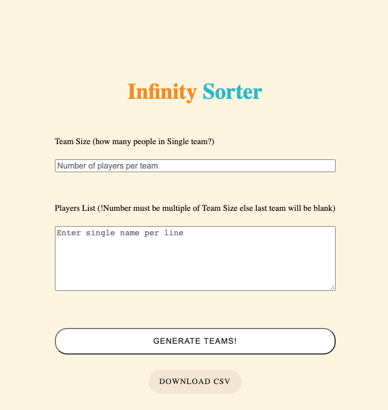
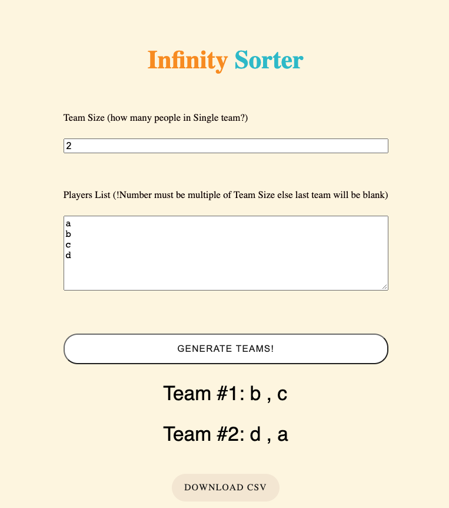
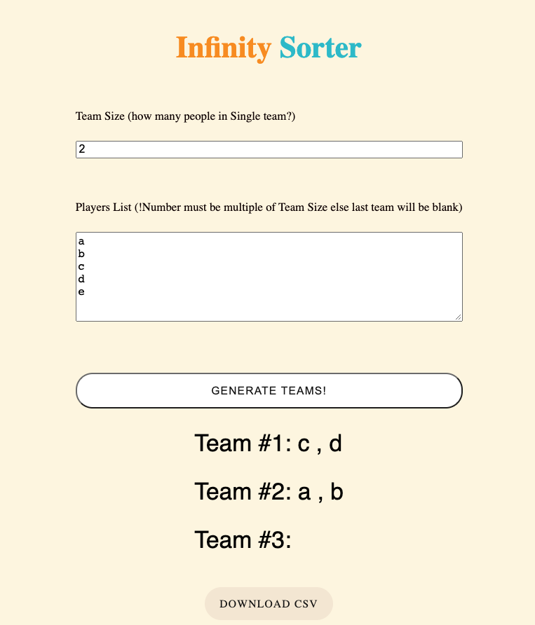

# Random-Team-Generator
Random Team Generator

Visit this to [Generate-teams-now](https://rameshgkwd05.github.io/Random-Team-Generator/)

This simple html webpage helps you to create a random teams based on provided team-size and list of players.

## Steps to run this webapp on your own
1. Download/clone this repository
2. Run index.html on web browser

## UI Screens and usage

### Welcome screen with no input

### Sample input of 4 players and 2 teams

### Invalid input of 5 players and 2 teams

